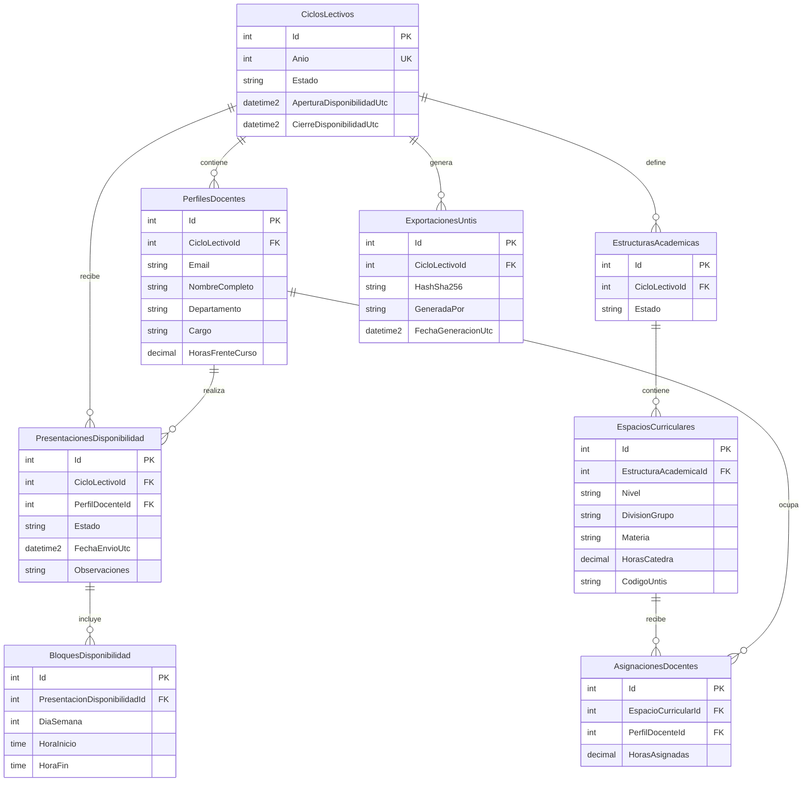

# DER inicial

El modelo se refinara junto con las reglas funcionales y cada migracion EF Core.

`Usuarios` mantiene roles privilegiados; la autoalta docente se materializa en `PerfilesDocentes`. `Auditoria` es append-only y referencia actores por email.

