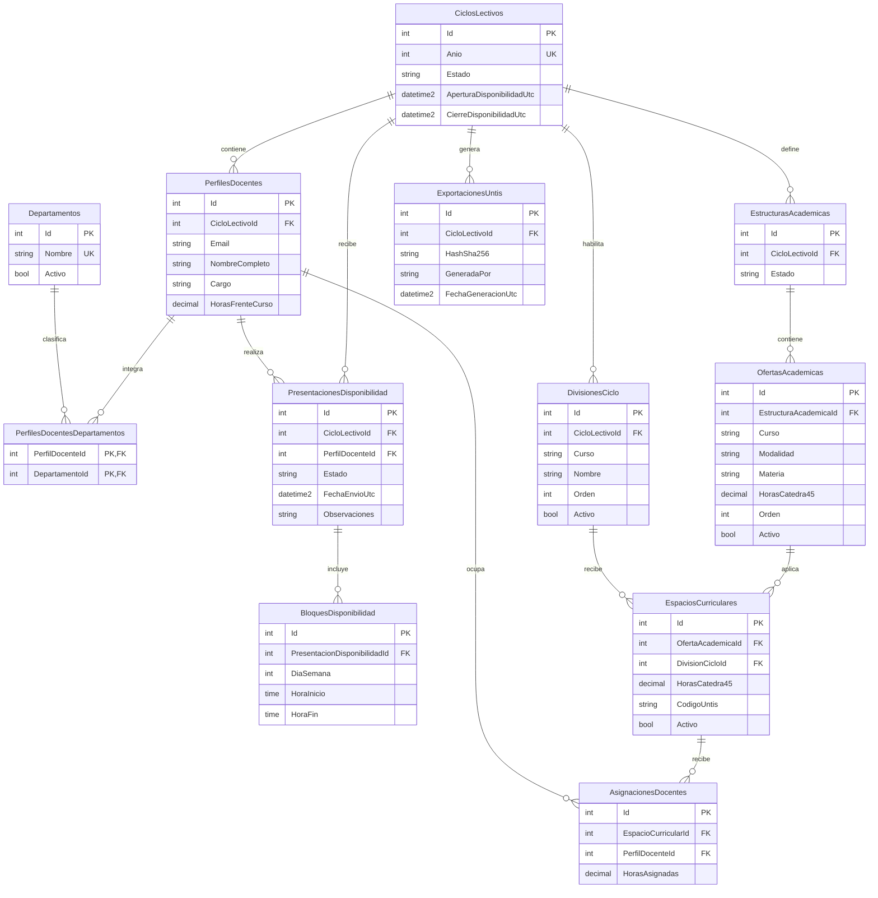

# DER inicial

El modelo se refinara junto con las reglas funcionales y cada migracion EF Core.

`Usuarios` mantiene roles privilegiados; la autoalta docente se materializa en `PerfilesDocentes`. Cada perfil puede vincularse con varios `Departamentos` mediante una relacion muchos-a-muchos. `OfertasAcademicas` representa las filas de la matriz y `EspaciosCurriculares` solo sus celdas aplicables; una celda sin registro equivale a "No aplica". `Auditoria` es append-only y referencia actores por email.
